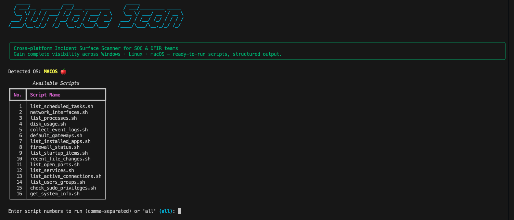

# SurfaceScan 🛡️

**Cross-platform Incident Surface Scanner for SOC & DFIR teams**  
*Gain complete visibility across Windows · Linux · macOS — ready-to-run scripts, structured output.*

[](https://github.com/username/SurfaceScan/stargazers)
[](https://github.com/username/SurfaceScan/issues)
[](./LICENSE)
[](#) <!-- Replace with real CI badge -->
[](#)

---

<!-- Banner (replace the placeholder with your generated banner image) -->
<p align="center">
  
</p>

---

## Table of Contents

- [About SurfaceScan](#about-surfacescan)
- [Why SurfaceScan?](#why-surfacescan)
- [Features](#features)
- [Supported Platforms](#supported-platforms)
- [Quick Start](#quick-start)
- [Usage Examples](#usage-examples)
- [Script Functions (Blueprint)](#script-functions-blueprint)
- [Output Format & Dashboard](#output-format--dashboard)
- [Security & Safety](#security--safety)
- [Contributing](#contributing)
- [License](#license)

---

## About SurfaceScan

**SurfaceScan** is a professional, open-source **incident surface scanner** designed for SOC analysts, DFIR teams, and security engineers.  
It provides ready-to-run, modular scripts for **Windows (PowerShell)**, **Linux (Bash)**, and **macOS (Bash/zsh)** to collect telemetry, configuration, and state information from endpoints. Outputs are normalized to JSON/CSV for ingestion into SIEMs, incident management platforms (TheHive, FIR), or internal dashboards.

**Keywords:** incident surface, SOC, DFIR, incident response, endpoint monitoring, attack surface mapping, cross-platform, PowerShell, Bash, Python.

---

## Why SurfaceScan?

- Centralize endpoint discovery data to map your organization’s attack surface.
- Speed up triage: run scripts quickly to collect the evidence analysts need.
- Standardized outputs (JSON/CSV) for automation and integration.
- Modular and extensible — add scripts for cloud, network devices, or IoT easily.
- Safe, non-destructive collection that’s auditable and reproducible.

---

## Features

- ✅ Cross-platform: Windows, Linux, macOS  
- ✅ Standalone, ready-to-run scripts for fast data collection  
- ✅ Structured JSON/CSV outputs (SIEM & automation friendly)  
- ✅ Aggregation tools to merge multi-host results into a single map  
- ✅ Optional HTML/Python dashboard for visualization  
- ✅ Extensible plugin model for cloud and network asset scanners  
- ✅ Non-destructive and built for safe SOC/DFIR usage

---

## Supported Platforms

- Windows 10 / 11 / Server 2016+ (PowerShell 5.1+ / PowerShell 7+)  
- Linux (Debian, Ubuntu, CentOS, RHEL, others)  
- macOS 10.15+ (Catalina+)  

---

## Quick Start

#### 1) Clone the repo

```bash
git clone https://github.com/username/SurfaceScan.git
cd SurfaceScan
```

#### 2) Create a Python virtual environment for tools

```bash
python -m venv .venv
source .venv/bin/activate
pip install -r requirements.txt
```

#### 3) Run an example script (Linux example)

```bash
 ./scripts/linux/list_users_groups.sh > output/linux-users-$(hostname).json
```

#### 4) Aggregate collected outputs

```bash
python tools/aggregate_data.py --input outputs/ --output aggregated/incident-surface.json
```

#### 5) Launch the dashboard (optional)

```bash
python tools/visualize_data.py aggregated/incident-surface.json
```

---

## Usage Examples

#### Windows (PowerShell)

Open an elevated PowerShell prompt to run scripts that **require admin privileges**:

```bash
# Collect basic system info and users
.\scripts\windows\get_system_info.ps1 -OutputPath .\outputs\windows-hostname-system.json
.\scripts\windows\list_users_groups.ps1 -OutputPath .\outputs\windows-hostname-users.json
```

#### Linux / macOS (Bash)

```bash
# Make sure script has execute permissions
chmod +x ./scripts/linux/list_processes.sh
./scripts/linux/list_processes.sh > outputs/linux-hostname-processes.json
```

---

## Script Functions (Blueprint)

The following table is the canonical blueprint of scripts to include. Each script should accept an `--output` or `-o` parameter to write JSON/CSV output and a --quiet flag for silent runs.


| Category       | Script Name (Suggested)                      | Purpose                                                | OS / Language |
|----------------|----------------------------------------------|--------------------------------------------------------|----------------|
| **System**     | `get_system_info`                            | Collect OS, hostname, uptime, CPU, memory, architecture | All            |
| **Users**      | `list_users_groups`                          | Enumerate local users, groups, last logon, admin flags | All            |
| **Privileges** | `check_sudo_privileges` / `check_admins`     | Identify users with root/admin/sudo rights            | All            |
| **Processes**  | `list_processes`                             | List running processes with PID, owner, CPU/MEM usage | All            |
| **Services**   | `list_services`                              | Gather services/daemons, status, startup type         | All            |
| **Installed Apps** | `list_installed_apps`                   | Enumerate installed software & versions               | All            |
| **Logs**       | `collect_event_logs` / `collect_syslogs`     | Collect Security/System/Application logs               | All            |
| **Network**    | `network_interfaces`                         | Get interfaces, IPs, MAC addresses                    | All            |
|                | `list_open_ports`                            | List listening ports + owning process                 | All            |
| **Connections**| `active_connections`                         | Enumerate active TCP/UDP connections                  | All            |
| **Routing**    | `default_gateways`                           | Extract routing table & default gateway               | All            |
| **Startup**    | `list_startup_items`                         | Startup apps, autoruns, login items                   | All            |
| **Tasks**      | `list_scheduled_tasks`                       | Cron jobs / Windows Scheduled Tasks                   | All            |
| **Firewall**   | `firewall_status`                            | Check firewall rules & status                         | All            |
| **Antivirus / EDR** | `antivirus_status`                     | Detect AV/EDR presence & status (best-effort)         | All            |
| **Disk**       | `disk_usage`                                 | Disk usage, mount points, free/used space             | All            |
| **Files**      | `recent_file_changes`                        | List files changed in last N days                     | All            |
| **VM/Cloud**   | `list_virtual_machines`                      | Detect hypervisors, VM indicators, cloud agents       | Optional       |
| **Threat Intel** | `cve_check_installed_software`             | Map installed apps to known CVEs                      | Optional       |
| **Export**     | `export_to_json`                             | Convert raw outputs into normalized JSON              | Python         |
| **Aggregate**  | `aggregate_data`                             | Merge multiple host outputs into one dataset          | Python         |
| **Visualize**  | `visualize_data`                             | Generate HTML dashboard or CSV/PDF reports            | Python/HTML    |


Each script should:

- Use safe, read-only commands (no destructive actions).
- Accept `--output` and `--format` flags.
- Return valid JSON (or JSONL) that follows the repo’s schema (see `/docs/schema.md`).

---

## Output Format & Dashboard

#### Standardized JSON schema (example snippet):

```json
{
  "host": "host-01",
  "os": "Ubuntu 22.04",
  "collected_at": "2025-11-25T12:00:00Z",
  "system": {...},
  "users": [...],
  "processes": [...],
  "services": [...],
  "network": {...},
  "logs": {...}
}
```

#### Dashboard

- A lightweight HTML dashboard (templates in /dashboards/simple_html_dashboard/) visualizes:
  - Top 10 hosts by number of open ports
  - Hosts with admin users
  - Recently modified critical files
  - Timeline of service changes

- Use python `tools/visualize_data.py aggregated/incident-surface.json` to generate `dashboard/index.html`.

---

## Security & Safety

- **Non-destructive by design:** All collection scripts are read-only unless explicitly documented.
- **Privileged operations:** Some scripts require admin/root rights. Always run under controlled conditions and obtain appropriate authorization.
- **Data sensitivity:** Collected outputs may contain sensitive data — store and transfer outputs securely (encrypted at rest/in transit).
- **Auditability:** Scripts log run metadata (who ran, when, arguments) for audit trails.

---

## Contributing

Contributions are welcome! Please follow these steps:

1. Fork the repository.
2. Create a feature branch: `git checkout -b feature/add-aws-scan`.
3. Add tests and documentation for new scripts.
4. Run linting and unit checks.
5. Open a Pull Request with a clear description and test results.

---

## License

Licensed under the **MIT License** — see [LICENSE](LICENSE) for details.