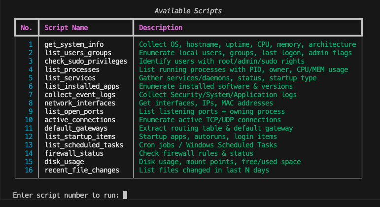

# SurfaceScan 🛡️

**Cross-platform Incident Surface Scanner for SOC & DFIR teams**  
*Gain complete visibility across ***Windows*** · ***Linux*** · ***macOS*** — ready-to-run scripts, structured output.*


---

<p align="center">
  
</p>

---

## Table of Contents

- [About SurfaceScan](#about-surfacescan)
- [Why SurfaceScan?](#why-surfacescan)
- [Features](#features)
- [Quick Start](#quick-start)
- [CLI Usage](#cli-usage)
- [Script Functions (Blueprint)](#script-functions-blueprint)
- [Output Format & Dashboard](#output-format--dashboard)
- [Security & Safety](#security--safety)
- [Contributing](#contributing)
- [License](#license)

---

## About SurfaceScan


**SurfaceScan** is a professional, open-source **incident surface scanner** designed for SOC analysts, DFIR teams, and security engineers. 

It provides ready-to-run, modular scripts for **Windows (PowerShell)**, **Linux (Bash)**, and **macOS (Bash)** to collect telemetry, configuration, and state information from endpoints. Outputs are normalized to JSON for ingestion into SIEMs, incident management platforms (TheHive, FIR), or internal dashboards.

**Keywords:** incident surface, SOC, DFIR, incident response, endpoint monitoring, attack surface mapping, cross-platform, PowerShell, Bash, Python.


---

## Why SurfaceScan?

- Centralize endpoint discovery data to map your organization’s attack surface.
- Speed up triage: run scripts quickly to collect the evidence analysts need.
- Standardized outputs (JSON) for automation and integration.
- Modular and extensible — add scripts for cloud, network devices, or IoT easily.
- Safe, non-destructive collection that’s auditable and reproducible.

---

## Features

- ✅ Cross-platform: Windows, Linux, macOS  
- ✅ CLI with interactive script selection and ASCII banner  
- ✅ Runs as root/admin for full privileged access  
- ✅ Persistent terminal loop — select scripts multiple times without exiting  
- ✅ Structured JSON outputs (SIEM & automation friendly)  
- ✅ Outputs are selectable in CLI and can be opened directly  
- ✅ Non-destructive and built for safe SOC/DFIR usage

---

## Quick Start

#### 1) Clone the repo

```bash
git clone https://github.com/ilyess-sellami/SurfaceScan.git
cd SurfaceScan
```

#### 2) Create a Python virtual environment for tools

```bash
python -m venv .venv
source .venv/bin/activate
pip install -r requirements.txt
```

#### 3) Run the CLI

Linux / macOS::

```bash
sudo python cli.py
```

Windows (PowerShell as Administrator):
```bash
python cli.py
```
The CLI detects the OS, displays available scripts with emojis, and allows multiple selections.
You can type `?` to review scripts again or `exit` to quit.

---

## CLI Usage

- The CLI prints a **big ASCII SurfaceScan banner** and app description.

- Detects the **OS** and displays an **emoji**:

  - Windows 🪟
  - Linux 🐧
  - macOS 🍎

- Shows a **table of scripts**: number, script name, description.

- Run scripts by entering their number; after execution, the **output file path is printed in blue and underlined**.

- CLI remains open after running a script, allowing multiple script executions without restarting.

---

## Script Functions (Blueprint)

The following image is a screenshot of the table displayed in the CLI app.  
It shows all supported functions with their number, name, and description.  
You can choose the number of the function you want to run directly from the app.

<p align="center">
  
</p>

---

## Output Format & Dashboard

#### Standardized JSON schema (example snippet):

```json
{
  "host": "host-01",
  "os": "Ubuntu 22.04",
  "collected_at": "2025-11-25T12:00:00Z",
  "system": {...},
  "users": [...],
  "processes": [...],
  "services": [...],
  "network": {...},
  "logs": {...}
}
```

JSON outputs are saved in the `outputs/<OS>/` folder and can be opened directly from the CLI after execution.

---

## Security & Safety

- **Non-destructive by design:** All collection scripts are read-only unless explicitly documented.
- **Privileged operations:** Some scripts require admin/root rights. Always run under controlled conditions and obtain appropriate authorization.
- **Data sensitivity:** Collected outputs may contain sensitive data — store and transfer outputs securely (encrypted at rest/in transit).
- **Auditability:** Scripts log run metadata (who ran, when, arguments) for audit trails.

---

## Contributing

Contributions are welcome! Please follow these steps:

1. Fork the repository.
2. Create a feature branch: `git checkout -b feature/<feature-name>`.
3. Add tests and documentation for new scripts.
4. Run linting and unit checks.
5. Open a Pull Request with a clear description and test results.

---

## License

Licensed under the **MIT License** — see [LICENSE](LICENSE) for details.
